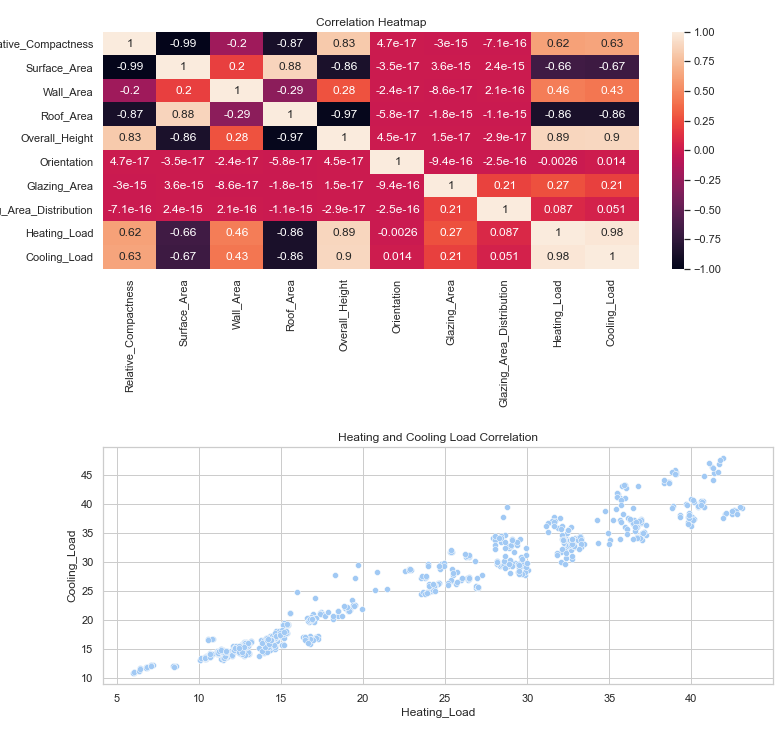
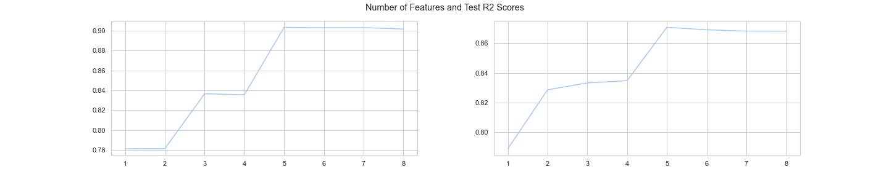
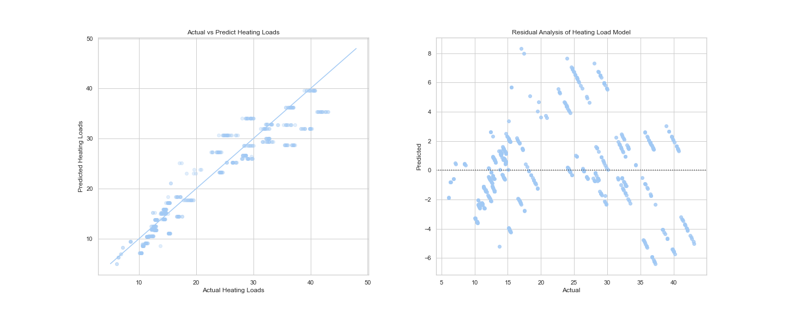
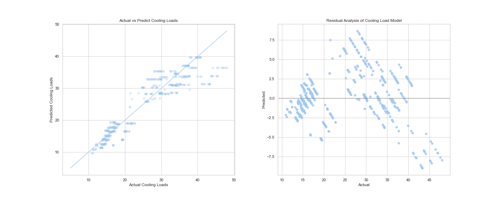
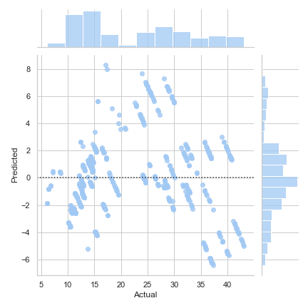
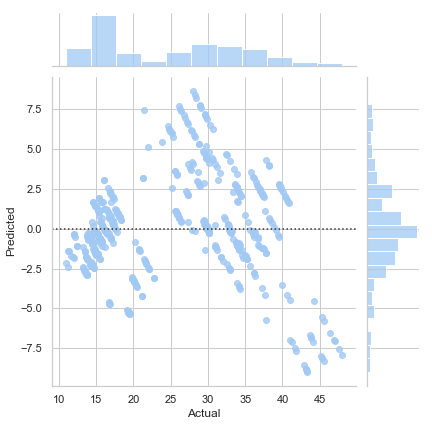
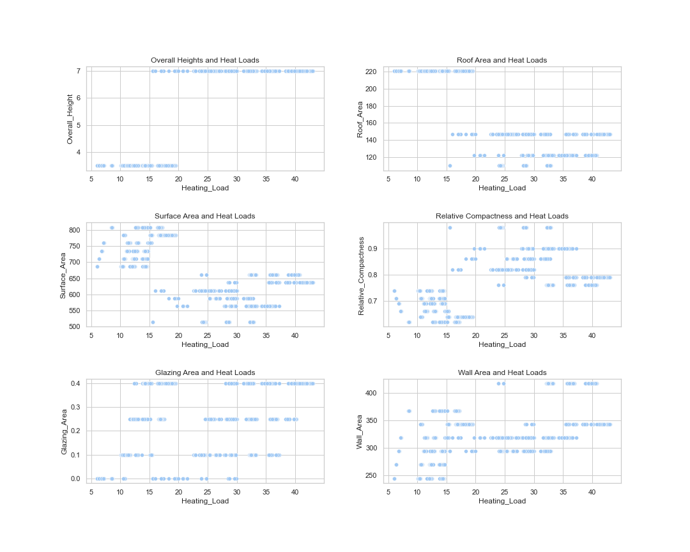

## Energy Efficiency Linear Regression

**Project description** 

We have been tasked with creating a predictive model of a buildings heating and cooling loads (Energy Efficiency). Our client, ABC Commercial Real Estate holdings has asked us to provide them with this predictive model so they can get and idea of the heating and cooling load of their entire portfolio without actually having to rate each building. There is a huge $ saving potential if we can provide them with an accurate way of predciting these metrics based off of the existing building characteristics they already have.

We have been provide with the building characteristics and the Heating and Cooling loads of 768 buildings in their portfolio which have already been rated. We will use this data to come out with our predictive model to help ABC Commercial Real Estate estimate their remaining 1,500 buildings in their portfolio

Link for Jupyter Notebook : (https://github.com/jniles1/jniles1.github.io/blob/main/Projects/Energy%20Efficiency%20Model.ipynb)

**Summary**

From our exploration of the data we concluded that the heating and cooling loads of individual buildings have a very strong correlation (0.98) which makes sense as the required energy to heat a building should also roughly equal the required energy to cool a building. Secondly we found that many of the buildings features correlated well with the heating and cooling loads and thus would be suitable for building a multiple linear regression model to test whether we could predict, with some accuracy, the heating and cooling loads of their already rated buildings.

Given the range in correlations between features and the predictor values we will use the recursive feature elimination wrapper method to determine the optimal features to get the best prediction results of the heating and cooling loads. After running the RFE it was determined that the optimal number of features is 5 which minmizes the Root Mean Square Error of the test predictions.

These features were:

1. Relative_Compactness
2. Surface_Area
3. Roof_Area
4. Overall_Height
5. Glazing_Area

It is no surpirse that the above features were selected as they are also the ones that have the highest levels of correlation based of our heatmap we produced during EDA.

Now that we have determined the optimal number of features we ran the linear regression model for both Heating and Cooling loads. Based on our model performance we can conclude the following:

1. The model performs slightly better in predicting the heating values then the cooling values as the R2 scores where higher in both training and test data for the heating model (See above RFE plots). Additionally the Root Mean Square Error was lower for both training and test in the heating model then when compared to the cooling model. You can see from plots below that overall the model is doing a good job at predciting, particularly in 10-15 load range were the majority of the buildings reside. The majority of the residuals for these values are within +/- 2 values of the actuals.
 
2. When we examined the residuals, we noticed that they were normally distributed with the majority of the residuals residing within +/- 3 points from the actual prediction. However we did notice that a pattern appeared in the plot, as the actual heating or cooling loads increased the residuals moved from the top left portion of plot down and to and to the right.

Heating Load Residuals

Cooling Load Residuals

While not ideal, as the residuals should ideally be independent of one another it may be due to the features available to us for input into the model. The highest correlated feature, overall height, only had 2 values and glazing area and roof area had 4 values each which can impact how the model develops its predictive capabilty as the actual loads vary across the limited values in the features. See below for scatter plots of the Actual Heating Loads of all buildings in the dataset vs the best predictor features chosen. This illistrates the point above that many of predictor features have a large range of heating loads across a small number of variables in each feature and I think this is hurting our models predictive capabilities, particularly in the large loads >20.

**Conclusion**

Based off our analysis and modeling of the building characteristics we can conclude that this regression model has scored well in prediciting the heating and cooling loads in the test data. Furthermore I would say that this model is fit for purpose for use by ABC company in using it to classify their remaining 1500 buildings which haven't been rated as this model will predict the heating and cooling loads will a good deal of accuracy. That said there are limiations, particular in the performance of predicting larger loads above 20 and the tendancy fro the model to over predict loads in the 20-30 range and under predict in the 40+ loads.
