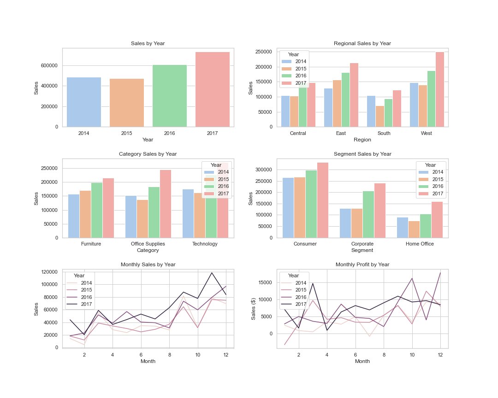

## Superstore Sales Analysis

**Project description:** The CEO has asked us to analyze the companies sales data for last 4 year (2014-2017) and pull out some insights on how we can becom more profitable, her bonus depends on it!

### 1. Analysis Overview

To do this we will use plots to answer the following questions:

1. Which regions are showing top sales in the company and how have they changed over time?

2. Which product cateogries and segments are most important to overall sales?

3. Which regions are most profitable and which categories and segments are driving profitability? 

```javascript
if (isAwesome){
  return true
}
```

### 2. Sales Analysis

Key Insights:

1. Sales dipped slightly in 2015 vs but rose in 2016 vs 2015 and 2017 vs 2016.
2. Sales growth in 2016 and 2017 was driven by East and West regions. Sales dipp in 2015 was driven by South and the decline in Office Supplies and Technology.
3. Technology and Office Supplies were key drivers of sales growth in 2017 vs 2016. However Furniture has been a YoY growth category for the company since 2014.
4. Season sales pattern exists in all years with sales picking up in August and continue to increase until end of December.



### 3. Profit Analysis

Key Insights:

1. East and West regions were most profitable which is not surprsing given they had the most sales. South and Central regions were least profitable and saw their profitability decline in the 2017 vs 2016.
2. From a segment perspective the Consumer and Corporate segments are accounting for majority of profit, however corporate has declined in 2017 vs 2016. Home Office has grown the most on a percentage basis in 2017 vs 2016.
3. Furniture is the least profitable category within the company, with Tables and Bookcases leading the way. Technology is the key profitability driver with copiers, phones and accessories driving profitability for the category.
4. Our Sales and Profit grid higlights the above point more clearly for sales transactions under 1,000 dollars. We can see furtniture, particularly in the Consumer and Corporate segments where a large portion of all of these sales are not profitable. Home Office segment in the technological category appears to be very profitable on a per transaction basis, particularly in the Central region.


### 4. CEO Recommendations

1.Shift focus of business to the technology category as this is fastest growing and most profitable category in your business. Also there appears to be a shift in sales moving from Corporate segment to the Home Office segment which may be signiling a trend in where employees are working. We should be monitoring this trend and shift our business if needed to focus on these customers.
2.Reduce level of discounting in Central region, particularly in Illinos and Texas where discounting is averaging 35% which is making it impossible to turn a profit. We may need to do further analysis to determine why we are discounting so much in these regions? Is it to hit sales targets? Competitoion in the area?  

For more details see [GitHub Flavored Markdown](https://guides.github.com/features/mastering-markdown/).
